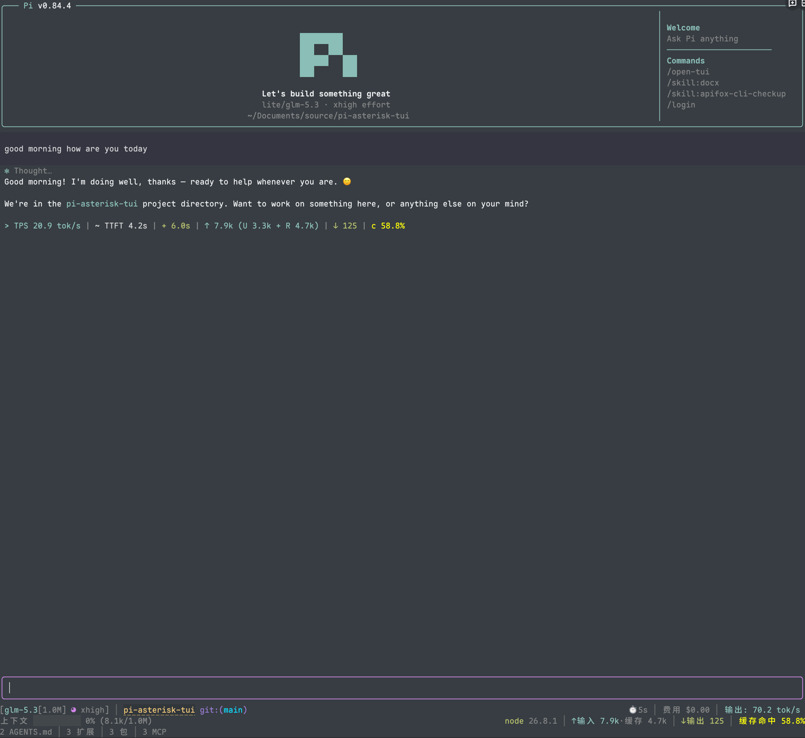

# pi-asterisk-tui

**English** | [简体中文](./README.zh-CN.md)

A [Pi](https://pi.dev) terminal experience where everything the model does folds into tidy
`✻` lines — Claude Code style.



```bash
pi install git:github.com/No-World/pi-asterisk-tui
```

## The ✻ lines

The transcript renders as answer text plus one `✻` line per activity phase:

```
✻ Thought for 19s, searched for 9 patterns, listed 1 directory, ran 1 shell command
```

- Consecutive thinking blocks and tool calls **merge into one line** — verbs read like a
  sentence (`ran 3 shell commands`, `edited 2 files`, `called playwright ×2`, with a
  capitalized leading verb when no thinking precedes).
- **Click the line** to open the full reasoning and every tool's bordered output at once;
  click any member to fold it all back. No second taps: text-bearing messages' thinking
  opens in the same click.
- A **running** tool renders as an animated one-liner (`⠋ bash · $ npm test`) with the live
  output streaming beneath it, and never drags completed neighbors out of their folded
  lines.
- History sessions fold the same way; thinking durations come from live telemetry, so
  history turns read `✻ Thought, ran 1 shell command`.

## Everything else

- **HUD footer** (claude-hud style, 4 lines): model + thinking level, git state with diff
  stats, session name, pure agent working time, cost, context bar, token stats with cache
  hit rate, tool usage counts, and per-file diff — plus a classic starship-style preset.
- **Working indicator telemetry**: `Working… (34s · ↓ 1.2k tokens · 3 tools)` — live token
  counts estimated from the stream (exact on completion), tool count as they start.
- **Turn telemetry** after each run: TPS, TTFT, duration, stalls, token breakdown, $/M rate.
- **Retry UX**: the countdown carries the failure reason
  (`Retrying (2/10) in 5s… · 429 rate_limit_error`); intermediate errors are held back and
  only the last one prints if the run ultimately fails. A successful retry prints nothing.
- Per-message thinking labels (`✻ Thought…` / `✻ Thinking…` while streaming), individually
  clickable, styled identically to the run lines.
- **Turn summary in the classic footer**: `✓ done 12s · ✻ 8s · 2 shell commands`.
- Framed editor with block/bar/underline cursors, fullscreen wheel-scroll tuning, and a
  bilingual `/open-tui` settings panel.
- Compact transcript spacing: pi's internal spacer padding and OSC shell-integration
  markers are folded away around ✻ lines.

## Requirements

- Pi 0.80+
- UTF-8 terminal; a [Nerd Font](https://www.nerdfonts.com/font-downloads) for the full icon
  set (ASCII icons are built in)
- **Fullscreen TUI** (`/settings` → TUI mode, or `"tuiMode": "fullscreen"` in
  `~/.pi/agent/settings.json`) for mouse interactions — click-to-expand needs pi's
  fullscreen mouse capture. Everything else works in regular mode.

## Configuration

Run `/open-tui` for the settings panel (English / 简体中文), or edit
`~/.pi/agent/open-tui.json`. Notable keys:

| Key | Default | Effect |
| --- | --- | --- |
| `footerStyle` | `"hud"` | `hud` / `classic` footer presets |
| `turnCollapse` | `true` | ✻ run lines and tool grouping |
| `telemetry.*` | on | working-indicator and post-turn telemetry fields |
| `fullscreen.wheelScrollLines` | `4` | mouse wheel lines per tick |

Fresh installs default pi's `hideThinkingBlock` to `true` (existing choices are never
overridden) so the ✻ experience works out of the box.

## How it works

Everything is a runtime patch over pi's extension surface, version-guarded and inert on
mismatch: the chat container's render is wrapped to re-chunk the transcript (containers,
messages, tools are classified by content, not appearance), the fullscreen viewport's mouse
input is intercepted to route clicks through per-render line segments, and pi-tui's loader
messages carry retry reasons. No pi files are modified on disk.

## Local development

```bash
npm install
npm test && npm run typecheck
pi -e .
```

## Acknowledgements

- **[OldSuns/pi-open-tui](https://github.com/OldSuns/pi-open-tui)** — this project began as
  a fork of it; the original integration work and its credits carry over.
- **[claude-hud](https://github.com/jarrodwatts/claude-hud)** — the HUD footer layout.
- **[pi-haiku](https://github.com/nnocte/pi-haiku)** — footer structure and working timer.

## License

MIT
