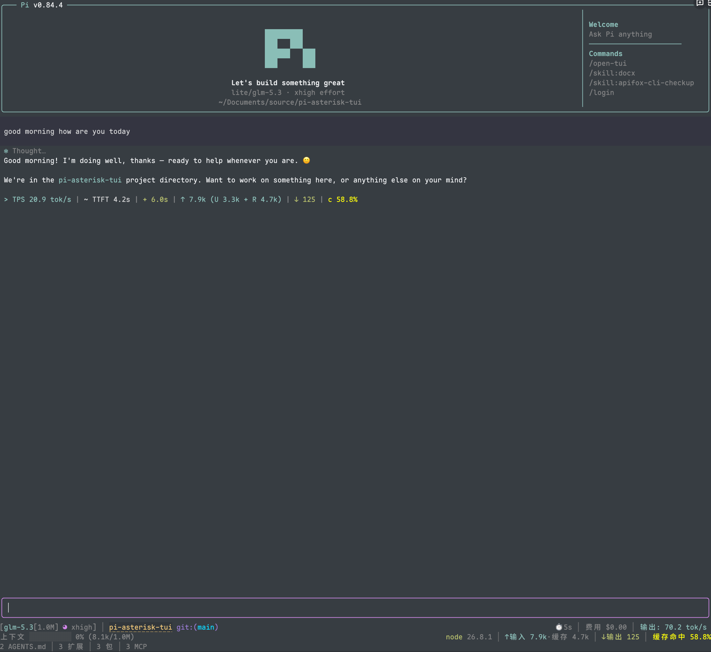

# pi-asterisk-tui

[English](./README.md) | **简体中文**

为 [Pi](https://pi.dev) 打造的终端体验——模型做的一切都折叠成整齐的 `✻` 行（Claude Code
风格），外加 claude-hud 风格的状态面板。



```bash
pi install npm:pi-asterisk-tui
```

或从 git 安装（跟随 `main`）：

```bash
pi install git:github.com/No-World/pi-asterisk-tui
```

## ✻ 转录

对话渲染为正文 + 压缩活动行。压缩到什么程度由**压缩模式**决定（`/*tui` → 压缩页）：

| 模式 | 渲染 |
| --- | --- |
| `native` | pi 原生渲染，不压缩 |
| `single` | 每个工具单独一行（`▸ bash · $ npm test`），互不归纳 |
| `group-same` | 连续同类工具归纳（`✻ read 3 files`）；思考单独归纳为 `✻ Thought for 11s`，互不合并 |
| `group-all` | Claude-Code 风格：连续思考 + 工具归纳为一行（默认） |

```
✻ Thought for 19s, searched for 9 patterns, listed 1 directory, ran 1 shell command
```

- **Run 行**（group-all）：动词读起来像一句话——`ran 3 shell commands`、`edited 2
  files`、`read 5 files`、`listed 2 directories`、`searched for 9 patterns`、`called
  playwright ×2`（前面没有思考时首字母大写）。思考时长来自实时遥测；历史轮次显示为
  `✻ Thought, ran 1 shell command`。
- **每工具覆盖**：每个工具可独立设为 default（跟随模式）/ single（单行）/ group-same（
  同类归纳行，不并入 ✻ 行）/ expand（原生盒子），`*` 通配未点名的工具。逐项状态是**绝对的**
  ——不随模式退化，group-same 在原生模式下照样归纳。
- **思考块**与工具共用同一套四态（`turnCollapse.thought`）：default（跟随模式）/ single（
  每条一行 ✻ 标签）/ group-same（归纳 Thought 行，不与工具合并）/ expand（内联展开，
  pi 原生）。整段并入 ✻ 行只有「模式 group-all + default」一条路径；pi 原生的
  hideThinkingBlock 仅作镜像，ctrl+t 翻转会被采纳为显式状态。
- **压缩行间隔**：compact（紧凑）或 classic（经典，压缩行前后各空一行，相邻压缩行之间
  只留一行；✻ 标签行也按压缩行对待，标签与后续正文之间同样空一行）。
- **一次点击展开/收回**：点击压缩行，完整思维链与所有工具的输出盒同时展开——包括
  带正文消息的思考，无需二次点击标签；点击任一成员行全部收回。点击 = 无修饰键按下并在
  同一格松开；拖选文本不会误触发展开/收回（pi 全屏自带的选区完全不受影响）。
- **逐消息思考标签**：`✻ Thought…`（历史）/ `✻ Thinking…`（流式中），可单独点击只展开
  那条消息的思维链，样式与压缩行完全一致（同色 ✻、同灰色正体文字）；也可在设置面板里
  直接开关（写入 pi 原生设置并同步当前会话）。
- **运行中的工具**渲染为动画单行（`⠋ bash · $ npm test`），下方实时流式输出，且不会把
  已完成的相邻工具拖出折叠行（native 模式保持纯 pi 盒子）。`turnCollapse.liveTools: false`
  可关掉实时输出盒，只留 spinner 单行；expand 覆盖的工具不受影响。
- **流式思考**（`turnCollapse.liveThinking`，默认开）：流式中的 thinking-only 消息实时内联
  显示思考内容；一旦该消息开始出正文（或停止流式），立即折回 ✻ 标签 / 归纳行，无需等
  整个 run 结束。
- **重试体验**：倒计时附带失败原因（`Retrying (2/10) in 5s… · 429 rate_limit_error`）；
  中间错误扣留不显示，重试成功什么都不打印，最终失败只输出最后一条（可独立开关）。
- **普通模式支持**：压缩行在 regular 模式（非全屏 TUI）同样生效——每条压缩行行尾标注
  当前生效的全部展开快捷键（如 `(ctrl+\ 展开)`），按一下整段展开（思维链 + 全部工具
  输出），再按一下全部收起；全屏模式仍以点击逐行展开为准。
- **紧凑间距**：✻ 行周围的 pi 内部 Spacer 与 OSC shell 集成标记一律折掉。

## 遥测

- **Working 指示器**：每段自带图标——时长（时钟）、速度、输入、输出、缓存命中、工具计数（扳手）：`Working… ( 34s · 󰓅 61.8 tok/s · ↑ 1.2k · ↓ 3.4k ·  96.0% ·  3)`——
  时长始终开头，其余各段均为工作状态页的独立开关（`workingLine.*`）。输出 token 按运行
  累计（流式期间增量估算、完成回填精确值，工具执行不清零）；这里的速度是从提交到当前帧的运行平均——HUD 底栏的速度段用整个 session 的平均值。
- **单轮遥测**：每次运行结束显示 TPS、TTFT、耗时、工具调用次数、输入/输出 token 明细（含缓存读/写）、缓存命中率、停顿次数/时长、实际花费与混合 $/M 费率（受缓存读占比主导）。
- **持久化**：每轮遥测以 session 自定义条目存储（扩展私有，不进模型上下文），并通过条目渲染器直接画成转录行——刚跑完和重进会话看到的是同一行、同一位置，按当前图标/语言设置格式化；回退剪枝时连同所属轮次一起剪掉。`telemetry.persist` 可关（默认开）；关闭时退回旧的一次性状态行，仅当前会话可见。
- **工具/摘要侧花费**：挂在工具结果（工具自身的 LLM 调用，如子代理）与压缩/分支摘要上的
  token 用量是真实会话成本，但不属于主上下文记账——对齐 pi 自身的 `Tools/summaries` 桶，
  单独累计并以暗色后缀附在费用段上（`$0.012+$9.500 tools` / `费用 $0.01+$9.50 工具`），
  两种底栏一致；今日费用同口径汇总。无侧花费时渲染与从前完全一致。
- **Classic 底栏单轮摘要**：`✓ done 12s · ✻ 8s · 2 shell commands`。

## HUD 底栏

claude-hud 风格四行面板（同时内置 starship 风格 classic 预设）：

1. **状态行**——模型与上下文窗口、思考强度（月相图标；模型名、图标与档位文字
   共用思考档位色，与输入框边框一致——含 `max` 档在内全部档位）、git 分支与脏标记、
   ahead/behind、逐文件增删统计 `[+71 -5]`、会话名、累计工作时长、费用、今日费用、
   实时输出速度（tok/s；仅在该条消息流式传输满 1 秒后才更新——瞬发式爆发的响应
   无法测速，保留上一条可信速度）。
2. **上下文行**——用量进度条、百分比与 token 数、缓存命中率，以及压缩次数后缀（`hud.compactions`，默认开，发生过压缩才显示）：`·  压缩 2`。Token 统计有三种呈现（`hud.tokens`）：本地化完整标签 `verbose`、语言无关的紧凑速记 `compact`（图标+数值，如 `77M (U 855k + R 77M) │ 266k │ 98.9%`）、或 `off`。统计段（时长、费用、今日费用、输出速度、token、缓存命中）的呈现由 `hud.statStyle` 控制：`icon`（纯图标）/ `icon+text`（图标+文字，默认）/ `text`（纯文字）；图标与遥测行、classic 底栏共用同一 glyph 集，`icons.mode: "ascii"` 下有符号回退。
3. **工具行**——按工具的调用计数（✓ 标记）、运行中的工具标签。
4. **环境行**——MCP 服务器计数（pi ≥0.99 统计原生 `mcp.json` 服务器——全局、受信项目、
   扩展运行时注册——过渡期 pi-mcp-adapter 的配置链仍同时计数，同名时原生优先）、
   内存占用、压缩次数、pi 版本。

另有：工作目录与变更文件的 OSC 8 超链接（点击打开）、powerline 风格 git 段、
ahead/behind 指示，以及完整的仓库子目录 git 检测（pi 原本在仓库子目录启动时无法显示
分支状态）。

## 编辑器与设置

- 带边框编辑器，块状 / 竖线 / 下划线三种光标样式。
- **工作状态**（`/*tui` → 工作状态页，`workingStatus`）：运行中状态显示在哪——`line`（仅 pi 的 Working 行）、`border`（仅编辑器上边框）或 `both`（默认，两者）。两个展示面信息对等，内容选项同序（时长、速度、输入、输出、命中、费用、工具），仅在对应模式启用时出现。费用段按运行计——本次输入至今的花费，非 session 总花销（总花销在底栏费用段），且与底栏同为三态——`off` / `cost` / `cost+rate`（后者追加混合 $/M 费率）。输入 token 为三态——关闭 / 运行总数 / 总数+缓存读（`↑ 348k (R 298k)`，按消息边界更新）。任一面全关时兜底显示时长；边框按宽度退化（各段 → 时长 → 图标）。速度口径：工作展示面用「响应时间」运行平均——运行输出 token ÷（提交至今墙钟时长 − 工具执行时间），TTFT 计入响应时间、工具等待不计，与旁边的时长、token 段肉眼可对账；两面共用同一份 500ms 快照（边框随流式重绘但只画缓存文本，永远不会比 Working 行快一拍）。HUD 底栏的速度段用整个 session 的平均速度——本 session 全部消息的输出 token 除以流式窗口合计，跨运行不清零，重进会话时由持久化的遥测条目重新播种，重启不丢。边框状态随边框着色（与思考级别 / bash 模式变色同源），窄边框退化为仅图标，滚动提示（`↑ 3 more`）保持居中槽位。旧 `borderWorkingStatus` 自动迁移（`true`→`both`、`false`→`line`）。「border」模式下 pi 自身的重试倒计时与上下文压缩状态也移入边框（原生嵌入路由）；「line」/「both」保持独立状态行。
- **内嵌底栏**（`inlineFooter`，默认关，仅 classic 风格）：把 classic 底栏的两行主内容
  画进编辑器边框——上边框左侧是位置段（cwd · 主机 · 会话 · git）、右侧是模型块；下边框
  左侧是轮末摘要、右侧是统计行（紧凑上下文 · token · 费用）。扩展状态行仍留在编辑器
  下方。宽度收缩时右侧块优先存活（与 plain 底栏的 alignRight 优先级一致）。工作期间
  下边框左格仅在 workingStatus 模式含边框时留空——`line` 模式下工作计时回退到
  下边框单元格，状态永不失踪。小屏终端省下两行垂直空间。`footerStyle: "hud"` 下此
  开关无效。
- **选区复制（全屏）三级模式**（`/*tui` 面板或 `selection.copy` 配置，默认
  `unwrapped`）：`plain` 按视觉内容复制（pi 原生，逐显示行）；`unwrapped` 按逻辑
  内容复制——软换行拼回逻辑行（段落、列表项、引用、表格换行单元格全部还原）；
  `raw` 按原始内容复制——markdown 覆盖段输出渲染前源文（`**加粗**`、`$x^2$`、
  表格管道原样；整条消息选中直接取原文；非 markdown 行只对该部分退回逻辑内容）。
  另有独立开关 `selection.trimPadding`（默认开）：选中高亮不覆盖补齐空白、
  视觉内容复制前后不多出边距空格。
  注意：此功能依赖 pi-tui 渲染内部结构，**pi 版本更新后可能静默失效**（自动回退
  pi 原生复制，不报错）；失效后升级本扩展即可恢复。
- 双语 `/*tui` 设置面板（英文 / 简体中文，语言选择同时作用于 HUD 标签）：底栏
  段落、HUD 开关、遥测字段、图标模式（nerd / ascii / auto）、光标样式、全屏滚轮速度，
  以及「压缩」页（压缩模式、压缩行间隔、重试错误折叠、思考块开关、每工具覆盖——
  扩展/MCP 工具在出现过一次后才列出）——含命名风格预设（hud / classic / custom）。
- 版本守护的兼容层：全屏滚轮速度依赖的运行时结构变化时自动回退 pi 默认值。
  pi ≥0.99 上该项整体让位——滚轮速度已原生内置（含加速的 `"auto"` 模式）且 pi 会在
  启动/设置变更时回写自己的值，设置项改为指向 `/settings → fullscreenWheelScrollLines`（ADR-0009）。

全新安装会把 pi 的 `hideThinkingBlock` 默认置为 `true`（已有选择永不覆盖），✻ 体验
开箱即用。

## 环境要求

- Pi 0.85+（带框编辑器的鼠标点击对齐依赖 pi-tui 的组件级鼠标事件）
- UTF-8 终端；完整图标集需要 [Nerd Font](https://www.nerdfonts.com/font-downloads)
  （内置 ASCII 图标）
- 两种 TUI 模式均可用：压缩行在普通（regular）模式下通过快捷键全部展开/收起
  （默认 `ctrl+\`，压缩行行尾有标注）；**点击逐行展开/收起**依赖 pi 的全屏鼠标捕获
  （`/settings` → TUI mode，或 `~/.pi/agent/settings.json` 里 `"tuiMode":
  "fullscreen"`）。

## 字体与图标

默认的 `auto` 模式检查终端环境而非字体文件——字体选择权在终端模拟器，没有任何环境
变量能证实 Nerd Font 生效（ADR-0006）。auto 在交互式 UTF-8 TTY 下使用 Nerd Font 图标
（含 SSH 场景——终端名单嗅探在 SSH 下永不透传），非交互输出、`TERM=dumb`、显式非
UTF-8 locale 时退回 ASCII。auto 首次解析为 nerd 时会发一条一次性提示，告知图标变方框
时的处置路径。`/*tui` → 外观 可选：

- `nerd`：在终端配置 Nerd Font 后强制使用 Nerd Font 图标
- `ascii`：纯文本图标，无需补丁字体
- `auto`：交互式 UTF-8 TTY 用 nerd；dumb / 非交互 / 非 UTF-8 用 ASCII

图标显示为方框时，要么改设 `ascii`，要么安装
[Nerd Font](https://www.nerdfonts.com/font-downloads) 并在终端配置文件里选中——
VS Code、Windows Terminal 等应用必须设在终端配置文件里，只装到操作系统不算。

## 配置

`/*tui` 打开设置面板，或直接编辑 `~/.pi/agent/asterisk-tui.json`（首次运行会自动把旧
`open-tui.json` 的设置收养过来，旧文件保留不动）：

| 键 | 默认 | 作用 |
| --- | --- | --- |
| `footerStyle` | `"hud"` | `hud` / `classic` 底栏预设 |
| `turnCollapse.mode` | `"group-all"` | 压缩模式：`native` / `single` / `group-same` / `group-all` |
| `turnCollapse.style` | `"compact"` | 压缩行间隔：`compact` / `classic` |
| `turnCollapse.retryErrors` | `true` | 运行期间扣留重试错误；连续请求错误折叠为一行 `⚠ … ×N`（可点击展开） |
| `turnCollapse.thought` | `"default"` | 思考块：`default` / `single` / `group-same` / `expand` |
| `turnCollapse.liveThinking` | `true` | 流式期间内联显示思考内容，结束后折回 |
| `turnCollapse.liveTools` | `true` | 运行中在 spinner 行下方渲染实时输出盒 |
| `turnCollapse.expandAllKey` | `"ctrl+\\"` | 普通模式全部展开/收起快捷键（pi KeyId；空串禁用；重启/重载后生效） |
| `turnCollapse.tools` | `{}` | 每工具 `default` / `single` / `group-same` / `expand`；`*` 通配 |
| `icons.mode` | `"auto"` | nerd / ascii / auto 图标集；auto = 交互式 UTF-8 TTY 用 nerd（ADR-0006），首次解析为 nerd 时有一次提示 |
| `cursorStyle` | `"block"` | 编辑器光标样式 |
| `telemetry.*` | 开 | Working 指示器与轮末遥测字段；`telemetry.cost` 三态（`off` / `cost` / `cost+rate`）；`telemetry.persist`（开）把每轮遥测存为 session 条目并画成转录行（重进不丢） |
| `footerSegments.*` | 混合 | classic 底栏段落开关 |
| `footerSegments.hostname` | `false` | 可选主机名段（取主机名的首个标签）——多机 SSH 时一眼区分所在主机；HUD 侧同款开关为 `hud.hostname` |
| `footerSegments.capitalizeProviderName` | `true` | 首字母大写 provider 名；`false` 保留原始 id 大小写（适配 `cc-switch-zhipu-glm` 这类代理 id） |
| `workingStatus` | `"both"` | 运行状态显示在 Working 行 / 编辑器上边框 / 两者；旧 `borderWorkingStatus` 自动迁移（true→both、false→line） |
| `workingLine.*` / `workingBorder.*` | 混合 | 各展示面的内容选项（时长、速度、输入/输出 token、缓存命中、工具计数）；`*.input` 为三态（关闭/总数/总数+缓存），`*.cost` 为三态（关闭/花费/花费+平均费率）；按模式条件生效 |
| `workingBorder.elapsed` | `true` | 边框窄时始终退化为时长 → 图标 |
| `inlineFooter` | `false` | classic 底栏两行主内容改画进编辑器边框；`footerStyle: "hud"` 下无效 |
| `hud.*` | 开 | HUD 每个段落均可单独开关（`hud.tokens`：`verbose` / `compact` / `off`；`hud.statStyle`：`icon` / `icon+text` / `text`；`hud.cost`：`off` / `cost` / `cost+rate` 三态） |
| `fullscreen.wheelScrollLines` | `4` | 滚轮每格行数；pi ≥0.99 上无效——改用 pi 原生 `/settings` 的滚轮项 |
| `selection.copy` | `"unwrapped"` | 选区复制：`plain`（视觉内容）/ `unwrapped`（逻辑内容，默认）/ `raw`（原始内容）；依赖 pi-tui 内部结构，pi 升级后可能静默回退原生 |
| `selection.trimPadding` | `true` | 选区边距裁剪：高亮不覆盖补齐空白、视觉内容复制不含前后边距空格 |
| `selection.tabWidth` | `3` | 原始内容复制的 Tab 宽度：2–8 任意整数（`3` 与渲染一致）或 `tab` 保留制表符；逐块复制会从原文确定性恢复真实 Tab |

## 实现方式

全部能力都是构建在 pi 扩展面上的运行时补丁——版本守护、不匹配即静默失效：聊天容器
的渲染被包裹以对转录重新分块（容器/消息/工具按内容而非外观分类）；全屏视口的鼠标输
入只观察不拦截，同格按下→松开的点击经由逐帧行段路由；pi-tui 的 loader 文案携带重试原因。磁盘上的 pi 文件
不做任何修改。

## 本地开发

```bash
npm install
npm test && npm run typecheck
pi -e .
```

## 致谢

- **[OldSuns/pi-open-tui](https://github.com/OldSuns/pi-open-tui)**——本项目最初由其
  fork 而来；原整合工作及其致谢一并延续。
- **[claude-hud](https://github.com/jarrodwatts/claude-hud)**——HUD 底栏布局。
- **[pi-haiku](https://github.com/nnocte/pi-haiku)**——底栏结构与工作计时器。

## 许可证

MIT
